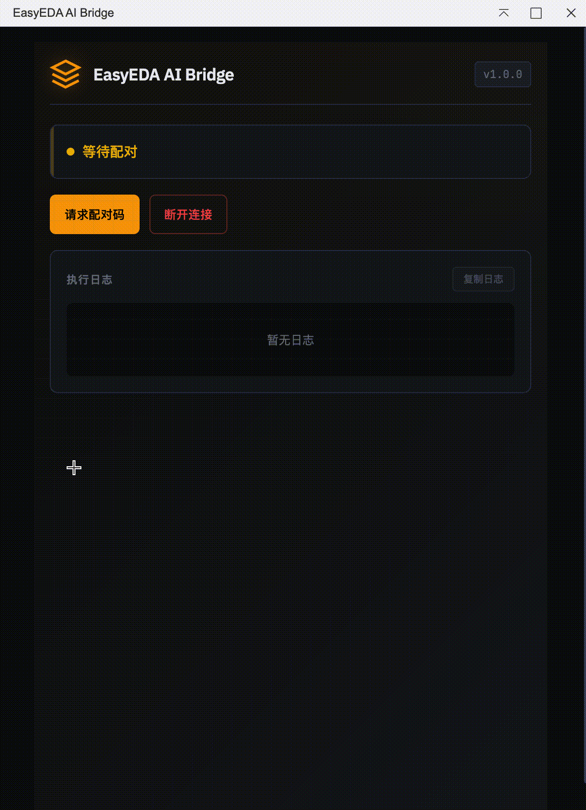
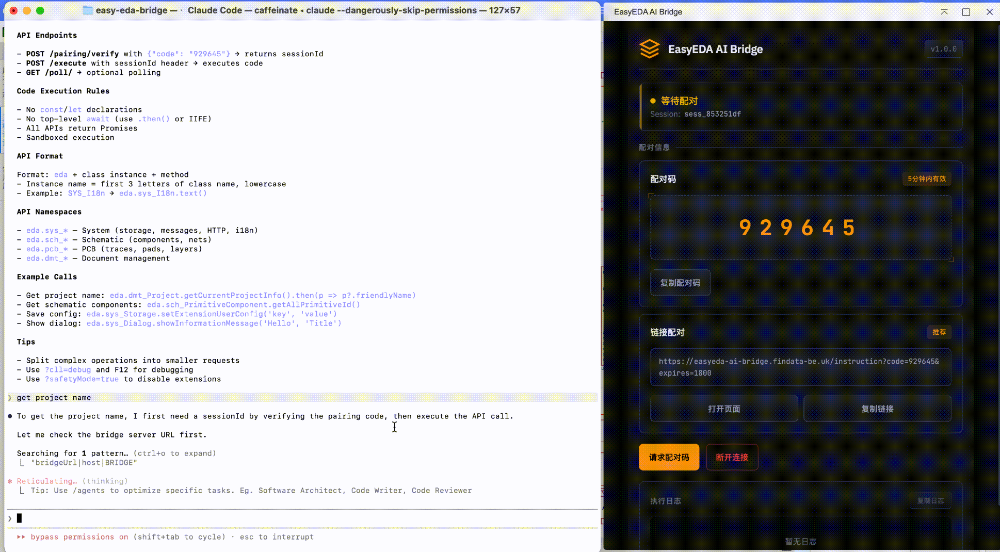

# EasyEDA AI Bridge

通过任意电脑（本地或远端）上的任意 AI Agent 远程控制嘉立创 EDA。

0 配置、开箱即用，无需安装任何 MCP 或 Skill。

完美支持 **Claude Code**、**OpenCode**、**Gemini CLI**、**Cursor**、**Cline**、**RooCode** 等主流 AI 编程工具。


## Demo





## 工作原理

```
[ 你的电脑 / 远程服务器 ]          [ 运行 EasyEDA 的电脑 ]
┌──────────────────────┐         ┌──────────────────────┐
│  AI Agent            │  配对   │  EasyEDA Pro         │
│  Claude / Gemini /   │◄───────►│  + AI Bridge 扩展     │
│  Cursor / Cline ...  │  连接   │                      │
└──────────────────────┘         └──────────────────────┘
```

无论 AI Agent 运行在本地还是云端服务器，只需通过配对链接，即可远程读取原理图/PCB 数据、放置器件、布线等。


## 快速开始

### 1. 安装扩展

在 EasyEDA Pro 中通过 **高级 → 扩展管理器** 加载 `.eext` 插件文件。

### 2. 配对连接

1. 点击菜单 **EasyEDA AI Bridge → 打开 AI Bridge**
2. 点击 **获取配对码**，复制生成的**配对链接**
3. 将配对链接发送到任意电脑上的 AI Agent 完成连接

## 常用 EDA API

```javascript
// 获取原理图所有器件
eda.sch_PrimitiveComponent.getAll(undefined, true)

// 获取原理图所有导线
eda.sch_PrimitiveWire.getAll(true)

// 获取 PCB 器件
eda.pcb_PrimitiveComponent.getAll()
```

完整 API 文档见 `packages/api-docs/references/classes/`

## License

Apache-2.0
