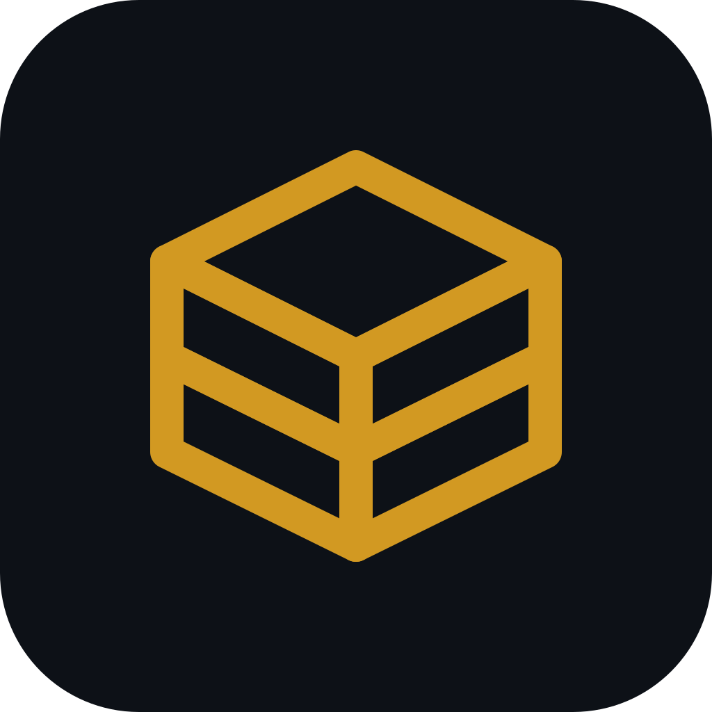

# EasyEDA AI Bridge

将 AI Coding 工具连接到你的 EasyEDA 设计工作区。

完美支持 **Claude Code**、**OpenCode**、**Gemini CLI**、**Cursor**、**Cline**、**RooCode** 等主流 AI 编程工具。



## 快速开始

### 1. 安装扩展

在 EasyEDA Pro 中通过 **高级 → 扩展管理器** 加载 `.eext` 插件文件。

### 2. 配对连接

1. 点击菜单 **EasyEDA AI Bridge → 打开 AI Bridge**
2. 点击 **请求配对码**，获取 6 位数字码
3. 在你的 AI Coding 工具中输入配对码完成连接

## 常用 EDA API

```javascript
// 获取原理图所有器件
eda.sch_PrimitiveComponent.getAll(undefined, true)

// 获取原理图所有导线
eda.sch_PrimitiveWire.getAll(true)

// 获取 PCB 器件
eda.pcb_PrimitiveComponent.getAll()
```

完整 API 文档见 `packages/api-docs/references/classes/`

## License

Apache-2.0
